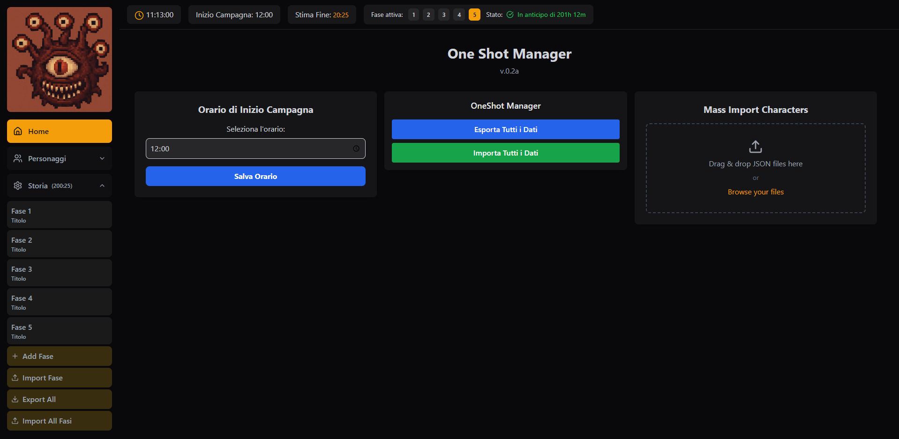

# 🐉 oneshotDash

**Dashboard per la gestione di campagne D&D 5e ottimizzata per one-shot e sessioni veloci.**



---

## 🎯 Funzionalità Principali

### 👥 Gestione Personaggi
- Creazione/Modifica schede personaggio con:
  - Punti caratteristica e bonus competenza
  - Informazioni di classe e livello
  - Abilità e bonus
  - Caratteristiche salienti
  - Equipaggiamento e note personalizzate
- Import/Export in formato JSON

### 📖 Strumenti per il DM
- Timeline avventura con fasi programmabili
- Calcolo automatico della durata delle sessioni
- Tracker tempo reale con:
  - Indicatore di anticipo o ritardo
  - Indicazione per superamento tempo stimato
- Import/Export completo dello stato della campagna

### ⚙️ TODO
- Polishing della grafica
- Modalità editing eventi d'azione avanzato
- Shortcut da tastiera
- Trovare un modo sano per importare le magie

---

## 🚀 Installazione

1. **Clona il repository**
   ```bash
   git clone https://github.com/tuo-repo/oneshotDash.git
   cd oneshotDash
   ```

2. **Installa le dipendenze**
   ```bash
   npm install
   # oppure
   yarn
   ```

3. **Avvia l'applicazione**
   ```bash
   npm run dev
   # Per build di produzione:
   npm run build && npm run preview
   ```

---

## 📌 Requisiti di Sistema

- Node.js v18+
- npm 9+ o yarn 1.22+
- Browser moderno (Chrome 115+ consigliato)

---

## 🤝 Contribuire

1. Fai un fork del repository  
2. Crea un nuovo branch per la feature  
   ```bash
   git checkout -b feature/nuova-feature
   ```
3. Fai commit delle modifiche  
   ```bash
   git commit -m 'Aggiunta nuova feature'
   ```
4. Push del branch  
   ```bash
   git push origin feature/nuova-feature
   ```
5. Apri una Pull Request

> ℹ️ **Nota**: Progetto in sviluppo attivo (v0.4.1b).

Completamente in Vibe Coding con Trae.ai
